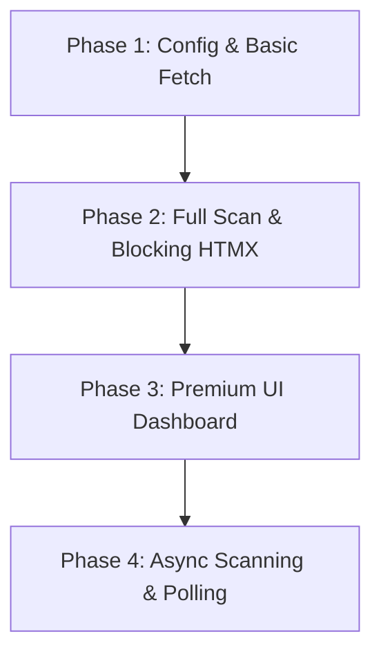

# Tube Medic Web Integration Plan (MVP)

This document outlines the audit findings comparing the CLI MVP (`tube-medic-mvp`) to the current Web server (`web`) and provides a phased plan for bringing all core features into the web experience.

---

## Executive Summary & Audit

The CLI MVP contains all the business logic for fetching channel data from YouTube, extracting links with their surrounding text context, classifying which links are revenue-generating, and concurrently checking link statuses while bypassing standard bot protection blocks.

The Web module currently consists of a simple router, home layout, and a static HTMX placeholder response.

### Component Comparison & Gap Analysis

| Feature Area | CLI MVP (`tube-medic-mvp`) | Web App (`web`) | Status & Action |
|:---|:---|:---|:---|
| **Workspace Integration** | Defines core business packages | Individual module in `go.work` | **Ready**. Can import packages directly via `github.com/aqfl/tmcore` |
| **API Configuration** | Loads `YT_API_KEY` from `.env` or CLI flags | Reads nothing | **Missing**. Need to load `.env` at web startup. |
| **Channel Retrieval** | Resolves channel URLs/handles; fetches videos & descriptions; tracks API quotas | Hardcoded response | **Missing**. Need form input parsing and YouTube client integration. |
| **Link Extraction** | Regex extraction + extracts 120-char context window | Hardcoded response | **Missing**. Integrate `scraper` package. |
| **Revenue Intelligence** | Classifies links using domain lists and context keywords | Hardcoded response | **Missing**. Integrate `classifier` package. |
| **Concurrently Check** | 10-worker concurrent GET requests with cookie jar and browser-like headers | Hardcoded response | **Missing**. Integrate `checker` package. |
| **UI & Reporting** | ANSI colored stdout; writes text report file | Basic home page and static form | **Incomplete**. Need to design results dashboard in HTML template. |

---

## Phased Implementation Plan

Since link checking is a network-bound task that can take **10 to 30 seconds** for 50 videos and hundreds of links, the user experience must be designed carefully to prevent HTTP timeouts and keep the interface responsive.

We will execute this integration in **4 distinct phases**:



---

### Phase 1: Environment Setup & Channel Resolution
**Goal**: Establish environment loading, API key validation, and basic handler setup to prove the Web container can contact the YouTube API.

1. **Environment Config**:
   - In `web/cmd/server/main.go`, load `.env` using a simplified file parser or a library if needed (or simply reuse the custom `.env` loader from `tube-medic-mvp/internal/config`).
   - Validate that `YT_API_KEY` is present in the environment before starting the server. If not, log a fatal error.
2. **Channel Resolution Handler**:
   - Update `HandleScan` in `web/internal/handlers/handlers.go` to parse the form body `channel`.
   - Call `youtube.ResolveChannel(apiKey, channelURL, nil)` to confirm the channel is valid.
   - Return a temporary HTML snippet confirming: `Resolved Channel: [Channel Name] (ID: [ID])`.

---

### Phase 2: End-to-End Scanning (Synchronous MVP)
**Goal**: Wire the full business pipeline so a user can input a URL, wait for the scan to finish, and receive raw output.

1. **Run Full Scanner Sequence**:
   - In `HandleScan`, invoke the full sequence using the local packages:
     ```go
     // 1. Fetch channel & videos
     ch, videos, quota, err := youtube.FetchChannel(apiKey, channelURL, 50)
     // 2. Extract links with context
     links := scraper.ExtractAll(videos)
     // 3. Check all links concurrently
     results := checker.CheckAll(links, 10)
     // 4. Summarize results
     summary := checker.Summarize(results)
     ```
2. **HTMX Loading Indicator**:
   - The scanning process can block the connection. Ensure the button in `web/templates/index.html` disables itself and displays the loading spinner correctly using HTMX's `hx-indicator` attribute (already set to `#indicator`).
3. **Basic Error Handling**:
   - Gracefully display errors if the channel cannot be resolved, or if the YouTube API quota is exceeded.

---

### Phase 3: Premium Dashboard & Report UI
**Goal**: Present the results in a beautiful, highly interactive web dashboard.

1. **Dashboard UI Elements**:
   - Update the HTML templates to structure scan results into cards:
     - **Stats Overview**: A flex grid showing Total Links, Live Links, Broken Links, and Revenue-Critical Broken Links with vibrant, semantic colors (emerald for live, rose/red for broken, crimson for critical).
     - **API Quota Card**: Shows units consumed (e.g. `102 / 10000 units remaining`).
   - Split broken links into two distinct, clear lists:
     - **Revenue-Critical Broken Links** (Rendered first in a bold crimson container, highlighting the product/affiliate type, the exact text context window, and a direct link to edit/view the video).
     - **Other Broken Links** (Rendered below).
2. **Interactive Details**:
   - Use simple dropdown elements (`<details>` / `<summary>`) or Tailwind tabs to let users inspect working links vs warning links vs broken links.
   - Render the context snippet with bold tags or highlighting around the broken link itself so creators know exactly where it is in their description.

---

### Phase 4: Async Scanning & HTMX Polling (Production Polish)
**Goal**: Scale the application to avoid HTTP connection timeouts and provide real-time scanning feedback.

1. **In-Memory Scan Store**:
   - Create a thread-safe global map or cache in the web application to store active scans:
     ```go
     type ScanJob struct {
         ID         string
         Status     string // "pending", "fetching", "checking", "completed", "failed"
         Progress   int    // percent complete
         Channel    *youtube.Channel
         Summary    *checker.Summary
         Results    []checker.CheckResult
         Error      string
     }
     ```
2. **Background Goroutine**:
   - Modify `HandleScan` to instantly generate a unique `ScanID`, start the scan sequence in a separate goroutine, register it in the cache, and return an intermediate "Loading/Progress" page.
3. **HTMX Status Polling**:
   - The returned page will use HTMX polling (`hx-get="/scan/status/{id}" hx-trigger="every 1.5s" hx-target="#results" hx-swap="outerHTML"`) to fetch updates.
   - The status endpoint will render either:
     - A beautiful progress bar showing the current phase (e.g. *"Checking link 42 of 115..."*).
     - The final full dashboard once `ScanJob.Status == "completed"`.

---

## Technical Considerations

1. **Concurrency Controls**:
   - Link checking uses high concurrency (10 parallel workers). If multiple users run scans concurrently, the server could exhaust file descriptors or trigger IP bans.
   - **Recommendation**: Implement a global job semaphore in `web` that limits the server to processing at most 2 or 3 active scans concurrently.
2. **WAF & IP Blocks**:
   - The `checker` package customizes headers and cookie jars, but running from a cloud provider server (like AWS or GCP) makes it highly susceptible to IP-based bot blocks.
   - **Recommendation**: Document the potential need for proxy rotation or integration with tools like `bogdanfinn/tls-client` if the server is deployed to cloud infrastructure.
3. **Vite Workers**:
   - Since the project utilizes electron/Vite build steps in other workspaces (referenced in memories), ensure any frontend worker or configuration remains isolated from the standard Go-HTMX web flow.
